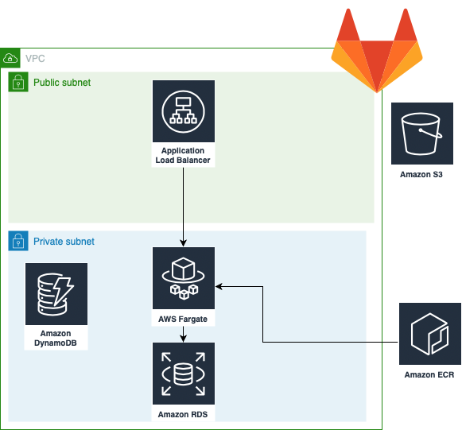

*************************************************
Nordcloud Assignment: Migration of Notejam to AWS
*************************************************

| docker-compose version: 1.6
| docker-image for terraform: hashicorp/terraform:0.12.21
| docker-image for build and push: docker:19.03.5 (docker in docker)

===========
Description
===========
In this assignment Notejam application has been migrated to Amazon Web Services by utilizing container and serverless technologies which is highly available, scalable, fault tolarant and easy to replicate to multiple regions.

=============
Prerequisites
=============
- Gitlab account
- AWS account
- Docker
- Terraform

====================
Architecture Diagram
====================

============================
Tools & Cloud Services Used:
============================

- Terraform - for Infrastructure as a Code (IaaC)
- Docker - 
- AWS VPC - Securing the applicaiton in a virtual private cloud by restricting access through IPs, Security Groups, NACLs etc.
- Fargate - Serverless Compute engine for Containers
- Amazon Elastic Container Registry (ECR) - for storing Docker Images
- Application Load Balancer - to distribute the application traffic to multiple serverless instances of the application
- Amazon S3 bucket - Backend of Terraform - stores state file (Versioning Enabled)
- Amazon DynamoDB - stores state lock for Terraform
- Gitlab - CI&CD deployment of entire pipeline

==========================
Rejoinder for Requirements
==========================

The Application must serve variable amount of traffic. Most users are active during business hours. During big events and conferences the traffic could be 4 times more than typical.
    Reply: Scaling policies has been enabled in ECS Service defination in a way that the application is up and running all the time, and application scales when the load increases.
    
The Customer takes guarantee to preserve your notes up to 3 years and recover it if needed.
    Reply: The storage of Notes is migrated to RDS PostgreSQL with backups enabled so that the storage is isolated and is preserved until the RDS is explicitly deleted.

The Customer ensures continuity in service in case of datacenter failures.
    Reply: The proposed solution is deployed across Availability zones such that even if a data center fails, the traffic would be routed to another AZ.

The Service must be capable of being migrated to any regions supported by the cloud provider in case of emergency.
    Migration of the application to another region is very easy by just updating region parameter in deploy/main.tf file

The Customer is planning to have more than 100 developers to work in this project who want to roll out multiple deployments a day without interruption / downtime.
    CI-CD pipeline has been implemented such that Developers can commit their code to the repository and all the tests and deployments for new features would happen on the fly.
    The same pipeline can be used for multiple environments just by changing terraform workspace.

The Customer wants to see relevant metrics and logs from the infrastructure for quality assurance and security purposes.
    CloudWatch is enabled for almost all the services by default. Monitoring has been enabled explicitly for ECS tasks.

==========================
Installation and launching
==========================

-----
Clone
-----

Clone the repo:

.. code-block:: bash

    $ git clone https://gitlab.com/rajesh68/notejam.git 

=============
Build and Run
=============

-----
Local
-----

Change the directory:

.. code-block:: bash

    $ cd notejam/

Docker build:

.. code-block:: bash

    $ docker build -t nordcloudassignment .

Docker run:

.. code-block:: bash

    $ docker run -p 8000:8000 --rm nordcloudassignment

------
In AWS
------

Change the directory:

.. code-block:: bash

    $ cd notejam/

Create ECR Repo:

Docker build:

.. code-block:: bash

    $ docker build -t nordcloudassignment -f Dockerfile.prd .

Docker tag:

.. code-block:: bash

    $ docker tag nordcloudassignment:latest <ecr repo created in above step>:latest

Login to ECR Repo:

.. code-block:: bash

    $ aws ecr get-login-password --region eu-central-1 | docker login --username AWS --password-stdin <ecr repo created in above step>

Docker push:

.. code-block:: bash

    $ docker push <ecr repo created in above step>:latest

Environmental variables:

.. code-block:: bash

    $ export AWS_ACCESS_KEY_ID=<accesskeyid>
    $ export AWS_SECRET_ACCESS_KEY=<aws secret access key>

Terraform init:

.. code-block:: bash

    $ docker-compose -f deploy/docker-compose.yml run --rm terraform init

Terraform plan:

.. code-block:: bash

    $ docker-compose -f deploy/docker-compose.yml run --rm terraform plan

Terraform apply:

.. code-block:: bash

    $ docker-compose -f deploy/docker-compose.yml run --rm terraform apply

Build and Run (section) (local)
cd notejam/
-docker build
-docker run manage.py runserver...

to run in AWS:
cd notejam/
-Create ECR repo
-docker build
-docker tag with ecr name
-docker push
-export access key, env variables
docker-compose terraform init, plan, apply

Completely Automated solution:
Gitlab CI flow> screenshot and explain Stages
how to setup a pipeline, environmental variables> git secrets
how to deploy to Production

docker-compose

---------------
Pipeline Stages
---------------
- Validate Terraform
    - performs terraform validate and fmt
- Build and Push
    - Uses Docker in docker and performs
        - Installs Python3
        - Installs AWSCLI
        - Builds docker Image
        - Logs in, push and tag docker image to Amazon ECR

- Staging Plan
    - selects terraform workspace and terraform plan

- Staging Apply
    - selects terraform workspace and terraform apply
- Production Plan
    - selects terraform workspace as production and terraform plan
- Production Apply
    - selects terraform workspace as production and terraform apply
- Destroy
    - destroys the entire infrastructure using terraform destroy 

----------------------
Deploying the solution
----------------------
| With every commit the CI CD pipeline would be triggered

for now default sqlite we are using, in prod it is recommended to use RDS, tried a lot using RDS, but took more time fixing, comment RDS things in terraform
comment db names in task definition if required...
issue is in: django version 1.6 and release date is more than 5 years back.. i cannot bypass creating superuser... 
tried creating custom comand called initadmin to create using random creds, it worked once, but dint work later.. so i see this as a potential improvement.
